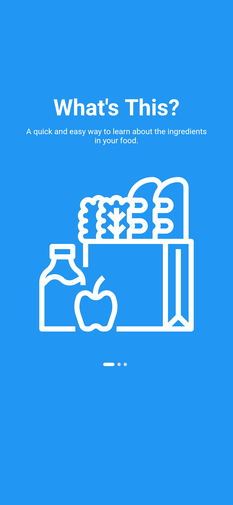
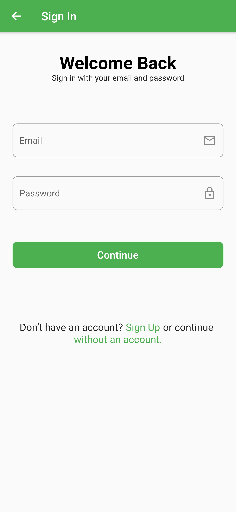
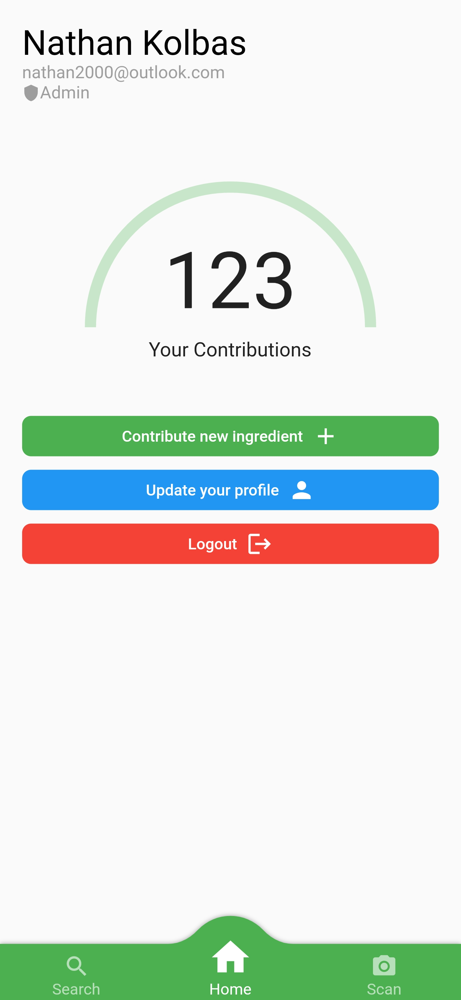
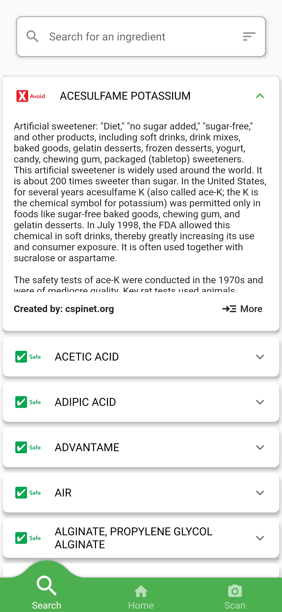
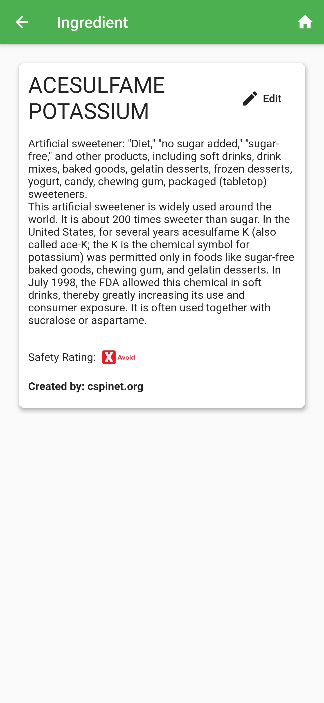
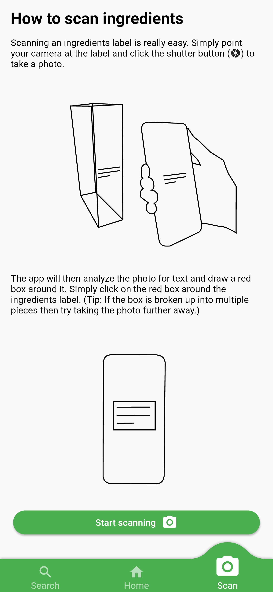

# Food Toxicity Scanner

This application was orginally developed within twenty-four hours for the 2020 [Cornhacks](https://cornhacks.com/) Hackathon. The team consisted of four people: [Aaron Friesen](https://github.com/Maugrift), Ethan Fox, Gabriel Adams, and [Nathan Kolbas](https://github.com/NathanKolbas).  

The purpose of the application is to take a photo of the ingredients label of any product and provide information about each ingredient. Starting data was collected from the [Center for Science in the Public Interset](https://cspinet.org/eating-healthy/chemical-cuisine). You can still find code for the original application located in the "deprecated" directory.  

## The NEW Food Toxicity Scanner
The old code has been replaced with a new application developed by [Nathan Kolbas](https://github.com/NathanKolbas). It uses [Flutter](https://flutter.dev/) for the front end and [Ruby on Rails](https://rubyonrails.org/) for the backend.  

## Screenshots

## Releases
You can find demo releases on the projects [GitHub page](https://github.com/NathanKolbas/FoodToxicityScanner/releases). This will showcase both the api and application working. Current I can only build the Android application as I don't have an Apple developer account.

## How it Works
The applications works by using [Firebase OCR](https://firebase.google.com/docs/ml-kit/recognize-text) recognition to find the ingredient's label. The text is then submitted to the api where it is then processed and returns back information about each ingredient. Currently, the api does this by simple regex but should be updated to use Natural Language Processing for much better results. The api also needs a better search function (planed to use Elasticsearch but didn't have time).  

## Project Structure
The project is sorted by directories. You can find the api in the "api" directory, flutter application in the "flutter" directory, and the old code in the "deprecated" directory.  

Each project has their own respective README's for more information.

## Flutter
The flutter application works for Android and iOS, however, I do not have an iOS device to test on. The project was built with keeping both platforms in mind. OCR will NOT work out the box. You will need to proved your own google-services.json file. More information about how to set this up can be found in the flutter README.

## API (Ruby on Rails)
As previously mentioned, the api was built using Ruby on Rails. The master key is removed for security reasons. This is needed for generating auth tokens and authorizing a user. More information in the api README.  

# Final Notes
Please feel free to contribute or mention issues in the [GitHub issue tracker](https://github.com/NathanKolbas/FoodToxicityScanner/issues). Have a wonderful day!
